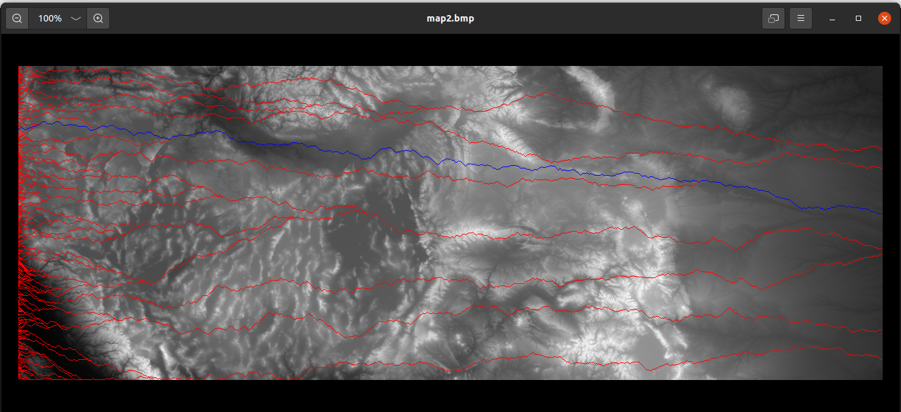

# Greedy-path

The TopoVisualizer project, implemented in C++, is a powerful tool for processing and visualizing topographic elevation data. The project comprises two main components: the Bmp class for handling BMP image files, and the Topograph class for processing and analyzing topographic data. The BMP class efficiently manages the reading and writing of BMP file headers and pixel data, ensuring seamless integration with the graphical representation of elevation maps. On the other hand, the Topograph class reads ArcGIS ASCII Grid files, extracts elevation data, and maps it to grayscale values. The implementation leverages a Greedy Walk algorithm to identify the path of least elevation change within the map, creating a visual representation with color-coded paths.

The Greedy Walk algorithm, employed in the drawGreedyPath method of the Topograph class, utilizes a straightforward approach to traverse the map. It iteratively selects the adjacent cell with the lowest elevation change from the current position, moving horizontally or diagonally. The algorithm optimizes the path by always choosing the path with the least elevation change in case of ties. The data structure used for storing elevation values is a 2D vector (vector<vector<int>>) named v, representing the height map. The paths are visualized using the BMP class, with colors indicating the elevation changes along the identified paths.


# TopoVisualizer

TopoVisualizer is a C++ project designed for processing and visualizing topographic elevation data. The project consists of two main classes: Bmp for managing BMP image files and Topograph for handling topographic data. The BMP class handles the reading and writing of BMP file headers and pixel data, while the Topograph class reads ArcGIS ASCII Grid files, maps elevation to grayscale values, and employs a Greedy Walk algorithm to identify optimal paths of least elevation change. The resulting visualization is generated as BMP images with color-coded paths.

## Usage

1. **Compile and Run:**
    ```bash
    g++ main.cpp Bmp.cpp Topograph.cpp -o TopoVisualizer
    ./TopoVisualizer
    ```

2. **Input File:**
   - Prepare an ArcGIS ASCII Grid file (e.g., `map_input.txt`) containing elevation data.

3. **Output Files:**
   - The generated BMP images, such as `map.bmp` and `map2.bmp`, visualize the elevation map and optimal paths.

## Implementation Details

- The project is implemented in C++ and utilizes two main classes: Bmp and Topograph.
- Bmp class handles BMP file I/O, while Topograph processes elevation data and visualizes maps.
- The Greedy Walk algorithm in Topograph's `drawGreedyPath` method efficiently identifies paths with minimal elevation change.
- Elevation data is stored in a 2D vector (`vector<vector<int>>`), facilitating easy access and manipulation.





